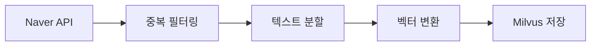
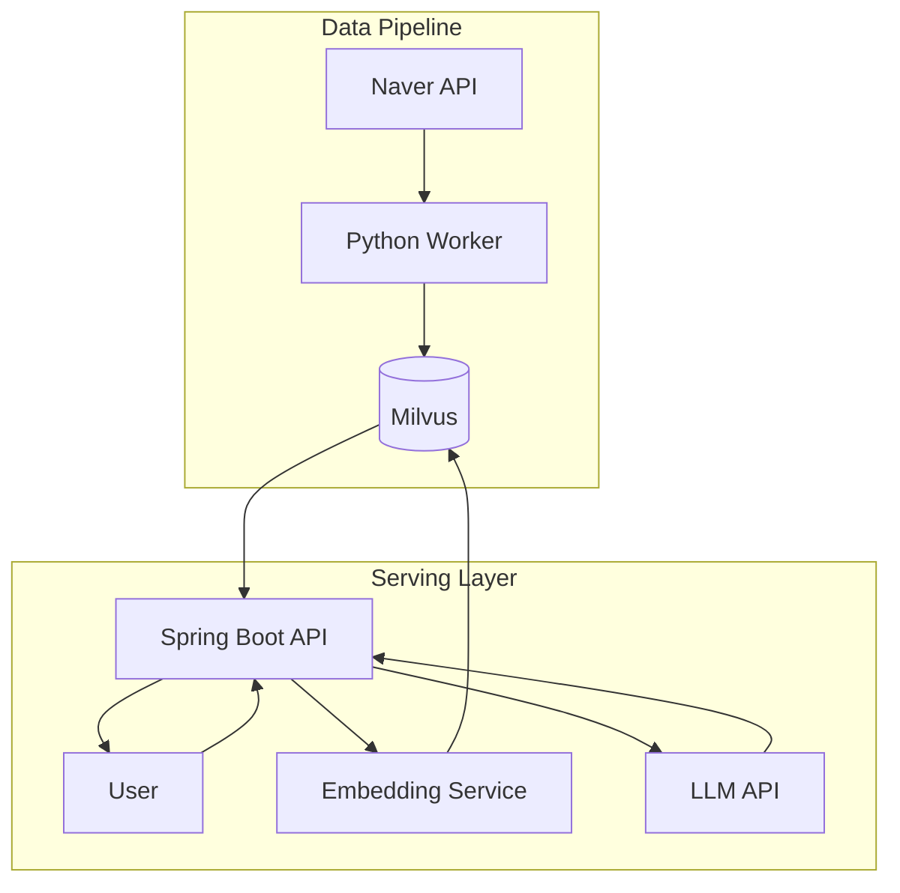

# Korean Stock News RAG System PRD

> **News Collection to Stock Recommendation Pipeline**

| 항목      | 내용                                               |
| --------- | -------------------------------------------------- |
| 버전      | 1.0.0                                              |
| 최종 수정 | 2025-12-21                                         |
| 대상 독자 | Backend Developers (Spring/Python), Data Engineers |

---

## 1. 개요

### 1.1 목표

한국 경제 뉴스를 수집하여 Vector DB(Milvus)에 저장하고, Spring Boot 애플리케이션을 통해 투자 인사이트를 제공하는 **비용 효율적이고 높은 정확도의 RAG(Retrieval-Augmented Generation) 시스템** 구축

### 1.2 핵심 제약사항

- **Zero/Low Cost**: 임베딩 및 데이터베이스 비용 최소화
- **한국어 특화**: 의미 검색(Semantic Search)에 최적화
- **Java Spring Boot 통합**: 백엔드 서비스 통합
- **고성능 벡터 검색**: 실시간 검색 지원

---

## 2. 기술 스택

### 2.1 데이터 수집

| 구성요소 | 선택                       |
| -------- | -------------------------- |
| 도구     | Naver Search API (News)    |
| 포맷     | JSON                       |
| 제한     | 25,000 requests/day (무료) |

### 2.2 전처리

| 구성요소    | 선택                           |
| ----------- | ------------------------------ |
| 프레임워크  | LangChain (Python)             |
| 분할기      | RecursiveCharacterTextSplitter |
| 청크 크기   | 500 characters                 |
| 청크 오버랩 | 50 characters                  |

### 2.3 임베딩

| 구성요소    | 선택                                            |
| ----------- | ----------------------------------------------- |
| 모델        | `jhgan/ko-sroberta-multitask`                   |
| 플랫폼      | HuggingFace (로컬 실행)                         |
| 차원        | 768                                             |
| 메트릭 타입 | L2 (Euclidean Distance) 또는 IP (Inner Product) |

### 2.4 벡터 데이터베이스

| 구성요소 | 선택                                        |
| -------- | ------------------------------------------- |
| 엔진     | Milvus                                      |
| 배포     | Docker Compose                              |
| SDK      | milvus-sdk-java (Spring), pymilvus (Python) |

### 2.5 서빙 레이어

| 구성요소       | 선택                       |
| -------------- | -------------------------- |
| 프레임워크     | Spring Boot 3.x            |
| LLM 인터페이스 | **Google Gemini API**      |
| 스케줄링       | n8n / cron (외부 스케줄러) |

---

## 3. 데이터베이스 스키마

### 3.1 Milvus Collection: `stock_news_v1`

> 청크된 뉴스 기사와 벡터 임베딩 저장소

**Consistency Level**: Bounded

| 필드명          | 타입             | 설명                           |
| --------------- | ---------------- | ------------------------------ |
| `news_id`       | Int64 (PK, Auto) | 청크 고유 식별자               |
| `embedding`     | FloatVector(768) | ko-sroberta 모델 벡터 출력     |
| `original_text` | VarChar(2000)    | RAG 컨텍스트용 텍스트 청크     |
| `title`         | VarChar(512)     | 뉴스 기사 제목                 |
| `published_at`  | VarChar(20)      | 날짜 문자열 (YYYY-MM-DD HH:mm) |
| `url`           | VarChar(1024)    | 출처 링크                      |

**인덱스 전략**:

```yaml
field: embedding
index_type: IVF_FLAT
metric_type: L2
params:
  nlist: 1024
```

---

## 4. 기능 요구사항

### 4.1 데이터 수집 파이프라인 (Python Worker)

**실행 주기**: 1시간 간격 스케줄링



**단계별 처리**:

1. Naver API로 최신 경제 뉴스 수집
2. URL/제목 기반 중복 필터링
3. LangChain `RecursiveCharacterTextSplitter`로 텍스트 분할
4. `ko-sroberta-multitask`로 벡터 변환
5. Milvus에 벡터 + 메타데이터 저장

### 4.2 검색 및 검색 (Spring Boot)

**입력**: 사용자 쿼리 (예: "반도체 주식의 최근 동향은?")

**처리 과정**:

1. 사용자 쿼리를 벡터로 변환 (마이크로서비스 또는 ONNX 런타임)
2. Milvus에서 벡터 검색 실행 (Top-K=5)
3. 검색 결과에서 `original_text`, `published_at` 추출

**출력**: 관련 뉴스 청크 목록

### 4.3 RAG 생성 (Spring Boot + LLM)

**처리 과정**:

1. 검색된 컨텍스트를 포함한 프롬프트 구성
2. LLM(GPT-4o-mini)에 프롬프트 전송
3. 시장 동향 분석 및 관련 섹터/주식 제안

**출력**: 인용이 포함된 최종 추천 텍스트

---

## 5. API 명세

### POST `/api/v1/recommendation`

**Request Body**:

```json
{
  "query": "사용자 질문 (String)",
  "lookback_days": 7
}
```

**Response Body**:

```json
{
  "answer": "LLM 생성 조언",
  "sources": [
    {
      "title": "뉴스 제목",
      "url": "https://...",
      "similarity_score": 0.95
    }
  ]
}
```

---

## 6. 프롬프트 템플릿

### System Prompt

```
You are a professional financial analyst specialized in the Korean market.
Answer the user's question using ONLY the following context.
```

### User Template

```
Context:
{context_str}

Question:
{query_str}

Task: Analyze the context and provide a stock recommendation or market outlook.
Cite the news titles where possible.
```

---

## 7. 아키텍처 다이어그램



---

## 8. 비기능 요구사항

| 항목      | 요구사항                         |
| --------- | -------------------------------- |
| 응답 시간 | 벡터 검색 < 100ms, 전체 API < 5s |
| 가용성    | 99% 업타임                       |
| 확장성    | 수평 확장 가능한 아키텍처        |
| 보안      | API 인증 (JWT), Rate Limiting    |
