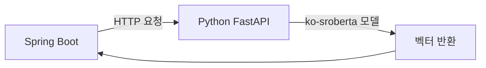
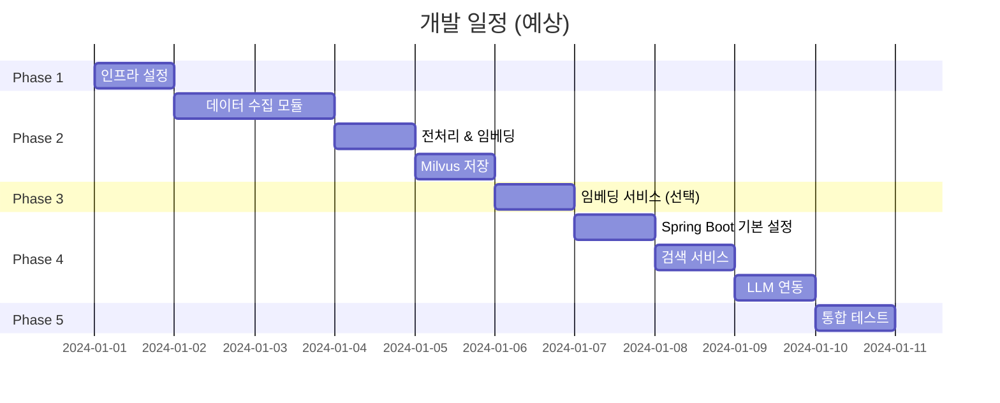

# Korean Stock News RAG System - 구현 계획

## 목표

한국 경제 뉴스 기반 RAG 시스템 구축: Naver API → Milvus Vector DB → Spring Boot API → **Gemini** 추천

---

## 선행 조건 ✅ 확인 완료

| 항목           | 상태 | 버전       |
| -------------- | ---- | ---------- |
| Docker         | ✅   | 28.5.2     |
| Docker Compose | ✅   | v2.40.3    |
| Python         | ✅   | 3.12.7     |
| Java           | ✅   | OpenJDK 23 |

---

## 확정된 결정 사항

| 항목            | 선택                  | 비고               |
| --------------- | --------------------- | ------------------ |
| **LLM**         | Google Gemini API     | 유료 구독 보유     |
| **스케줄링**    | n8n 또는 cron         | 외부 스케줄러 사용 |
| **임베딩 처리** | Python 마이크로서비스 | FastAPI 기반       |
| **Naver API**   | 발급 필요             | 아래 가이드 참조   |

---

## Naver API 발급 가이드

1. [Naver Developers](https://developers.naver.com) 접속
2. 애플리케이션 등록 → "검색" API 선택
3. Client ID / Client Secret 발급
4. `.env` 파일에 저장

---

## 임베딩 처리 설명

> **"Spring Boot에서 임베딩을 어떻게 처리할까?"**



**선택지:**

1. **Python 마이크로서비스** (추천): FastAPI로 임베딩 API 제공
2. **ONNX 런타임**: Java에서 직접 모델 실행 (복잡)

→ **Python 마이크로서비스 방식으로 진행** (더 간단하고 유지보수 용이)

---

## 프로젝트 폴더 구조

```
news2vector/
├── docs/                           # 문서
│   └── PRD.md
│
├── infrastructure/                 # 인프라 설정
│   └── docker/
│       └── docker-compose.yml      # Milvus, etcd, MinIO
│
├── data-pipeline/                  # Python 데이터 수집 파이프라인
│   ├── src/
│   │   ├── __init__.py
│   │   ├── main.py                 # 진입점
│   │   ├── config/
│   │   │   ├── __init__.py
│   │   │   └── settings.py         # 환경설정
│   │   ├── collectors/
│   │   │   ├── __init__.py
│   │   │   └── naver_news.py       # Naver API 수집
│   │   ├── processors/
│   │   │   ├── __init__.py
│   │   │   ├── text_splitter.py    # 텍스트 청킹
│   │   │   └── deduplicator.py     # 중복 제거
│   │   ├── embeddings/
│   │   │   ├── __init__.py
│   │   │   └── ko_sroberta.py      # 임베딩 생성
│   │   └── storage/
│   │       ├── __init__.py
│   │       └── milvus_client.py    # Milvus 저장
│   ├── tests/
│   │   └── ...
│   ├── requirements.txt
│   └── pyproject.toml
│
├── embedding-service/              # (선택) Python 임베딩 API
│   ├── src/
│   │   ├── __init__.py
│   │   ├── main.py                 # FastAPI 서버
│   │   └── models/
│   │       └── ko_sroberta.py
│   ├── requirements.txt
│   └── Dockerfile
│
├── rag-service/                    # Spring Boot RAG 서비스
│   ├── src/
│   │   └── main/
│   │       ├── java/com/news2vector/rag/
│   │       │   ├── RagApplication.java
│   │       │   ├── config/
│   │       │   │   ├── MilvusConfig.java
│   │       │   │   └── OpenAIConfig.java
│   │       │   ├── controller/
│   │       │   │   └── RecommendationController.java
│   │       │   ├── service/
│   │       │   │   ├── EmbeddingService.java
│   │       │   │   ├── SearchService.java
│   │       │   │   └── LLMService.java
│   │       │   ├── dto/
│   │       │   │   ├── RecommendationRequest.java
│   │       │   │   └── RecommendationResponse.java
│   │       │   └── domain/
│   │       │       └── NewsChunk.java
│   │       └── resources/
│   │           └── application.yml
│   ├── build.gradle
│   └── Dockerfile
│
├── scripts/                        # 유틸리티 스크립트
│   ├── init_milvus_collection.py   # 컬렉션 초기화
│   └── test_embedding.py           # 임베딩 테스트
│
├── .env.example                    # 환경변수 템플릿
├── .gitignore
└── README.md
```

---

## Proposed Changes

### Phase 1: 인프라 설정

#### [NEW] [docker-compose.yml](file:///Users/gyu/Desktop/프로젝트/news2vector/infrastructure/docker/docker-compose.yml)

- Milvus standalone 배포 (etcd, MinIO 포함)
- 포트: 19530 (gRPC), 9091 (metrics)

#### [NEW] [.env.example](file:///Users/gyu/Desktop/프로젝트/news2vector/.env.example)

- 환경변수 템플릿 (API 키, DB 연결 정보)

---

### Phase 2: Python 데이터 파이프라인

#### [NEW] [requirements.txt](file:///Users/gyu/Desktop/프로젝트/news2vector/data-pipeline/requirements.txt)

주요 의존성:

- `langchain`, `langchain-text-splitters`
- `sentence-transformers` (ko-sroberta)
- `pymilvus`
- `python-dotenv`, `httpx`

#### [NEW] [settings.py](file:///Users/gyu/Desktop/프로젝트/news2vector/data-pipeline/src/config/settings.py)

- Pydantic Settings로 환경설정 관리

#### [NEW] [naver_news.py](file:///Users/gyu/Desktop/프로젝트/news2vector/data-pipeline/src/collectors/naver_news.py)

- Naver Search API 호출
- 검색 키워드: 경제, 주식, 반도체 등
- 결과 파싱 및 정규화

#### [NEW] [text_splitter.py](file:///Users/gyu/Desktop/프로젝트/news2vector/data-pipeline/src/processors/text_splitter.py)

- RecursiveCharacterTextSplitter 래퍼
- 청크 크기 500, 오버랩 50

#### [NEW] [ko_sroberta.py](file:///Users/gyu/Desktop/프로젝트/news2vector/data-pipeline/src/embeddings/ko_sroberta.py)

- sentence-transformers로 임베딩 생성
- 배치 처리 지원

#### [NEW] [milvus_client.py](file:///Users/gyu/Desktop/프로젝트/news2vector/data-pipeline/src/storage/milvus_client.py)

- 컬렉션 생성/연결
- 벡터 삽입 및 중복 체크

---

### Phase 3: 임베딩 서비스 (선택)

#### [NEW] [main.py](file:///Users/gyu/Desktop/프로젝트/news2vector/embedding-service/src/main.py)

- FastAPI 기반 REST API
- `POST /embed` - 텍스트 → 벡터 변환
- Spring Boot에서 호출

---

### Phase 4: Spring Boot RAG 서비스

#### [NEW] [RagApplication.java](file:///Users/gyu/Desktop/프로젝트/news2vector/rag-service/src/main/java/com/news2vector/rag/RagApplication.java)

- Spring Boot 3.x 애플리케이션 진입점

#### [NEW] [RecommendationController.java](file:///Users/gyu/Desktop/프로젝트/news2vector/rag-service/src/main/java/com/news2vector/rag/controller/RecommendationController.java)

- `POST /api/v1/recommendation` 엔드포인트

#### [NEW] [SearchService.java](file:///Users/gyu/Desktop/프로젝트/news2vector/rag-service/src/main/java/com/news2vector/rag/service/SearchService.java)

- milvus-sdk-java로 벡터 검색
- Top-K 결과 반환

#### [NEW] [GeminiService.java](file:///Users/gyu/Desktop/프로젝트/news2vector/rag-service/src/main/java/com/news2vector/rag/service/GeminiService.java)

- Google Gemini API 연동
- 프롬프트 구성 및 응답 처리

---

## 개발 순서



---

## Verification Plan

### Automated Tests

#### Python 데이터 파이프라인

```bash
cd data-pipeline
pytest tests/ -v
```

- 단위 테스트: Naver API 모킹, 텍스트 분할, 임베딩 생성
- 통합 테스트: Milvus 연결 (Docker 필요)

#### Spring Boot RAG 서비스

```bash
cd rag-service
./gradlew test
```

- 단위 테스트: 서비스 레이어 모킹
- 통합 테스트: Milvus 연결, API 엔드포인트

### Manual Verification

1. **Milvus 데이터 확인**

   ```bash
   # Milvus CLI 또는 Attu GUI로 컬렉션 데이터 확인
   docker exec -it milvus-standalone ...
   ```

2. **API 테스트**

   ```bash
   curl -X POST http://localhost:8080/api/v1/recommendation \
     -H "Content-Type: application/json" \
     -d '{"query": "반도체 주식 동향", "lookback_days": 7}'
   ```

3. **E2E 플로우**
   - 데이터 파이프라인 실행 → Milvus 저장 확인 → API 호출 → 응답 검증

---

## 추가 질문 사항

1. **검색 키워드**: 어떤 키워드로 뉴스를 수집할까요?

   - 예: `["반도체", "2차전지", "삼성전자", "경제", "금리"]`

2. **데이터 보존 기간**: 오래된 뉴스는 삭제할까요?

   - 예: 30일 이후 자동 삭제

3. **인증/보안**: Spring Boot API에 인증이 필요한가요?

   - JWT, API Key 등

4. **모니터링**: Prometheus/Grafana 연동이 필요한가요?
